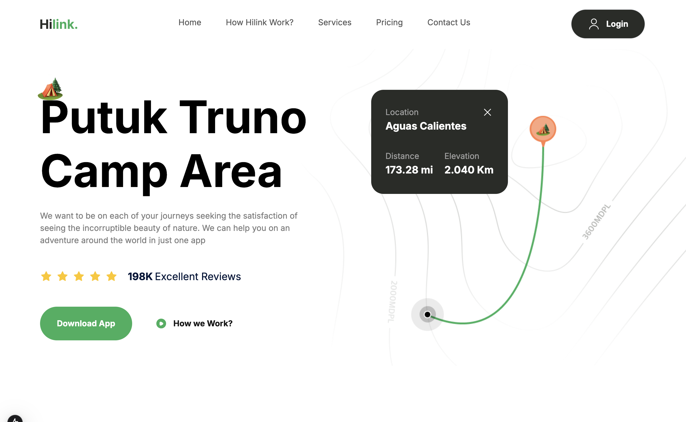
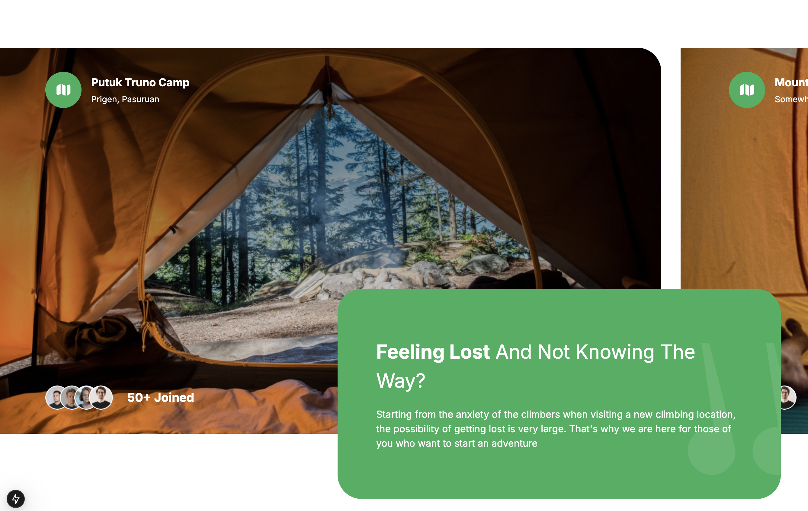

# Hilink


Hilink é um aplicativo de UX/UI voltado para camping, desenvolvido para proporcionar uma experiência única aos amantes da natureza. Com funcionalidades como mapas offline e agendamento de aventuras, o aplicativo é ideal para quem busca explorar novos locais sem se preocupar em se perder.




## 🚀 Tecnologias Utilizadas

- **Next.js**: Framework React para construção de aplicações web.
- **Tailwind CSS**: Framework CSS para estilização rápida e responsiva.
- **TypeScript**: Superset do JavaScript que adiciona tipagem estática.
- **React**: Biblioteca JavaScript para construção de interfaces de usuário.

## 🎨 Animações

O projeto utiliza animações para melhorar a experiência do usuário, tornando a navegação mais intuitiva e agradável. As animações são implementadas de forma a não comprometer o desempenho do aplicativo.

## 📱 Responsividade

A interface do Hilink foi desenvolvida com foco na responsividade, garantindo uma experiência consistente e adaptada em dispositivos de diferentes tamanhos de tela, desde desktops até smartphones.

## 📦 Como Executar o Projeto

### Pré-requisitos

- **Node.js**: Certifique-se de ter o Node.js instalado na versão 14 ou superior.
- **npm**: O npm é necessário para gerenciar as dependências do projeto.

### Passos para execução

1. **Clonar o repositório**:

   ```bash
   git clone https://github.com/G00li/hilink.git
    ```

    2. **Navegar até a pasta do projeto**:
    ```bash
    cd hilink
    ```

3. **Instalar as dependências**:
    ```bash
    npm install
    ```
4. **Iniciar o servidor de desenvolvimento**:
    ```bash
    npm run dev
    ```

5. **Acessar a aplicação**:
    
    Abra o navegador e vá para http://localhost:3000 para visualizar a aplicação em execução.

## 📄 Licença
Este projeto está sob a licença MIT.
Sinta-se à vontade para utilizá-lo e modificá-lo conforme necessário.